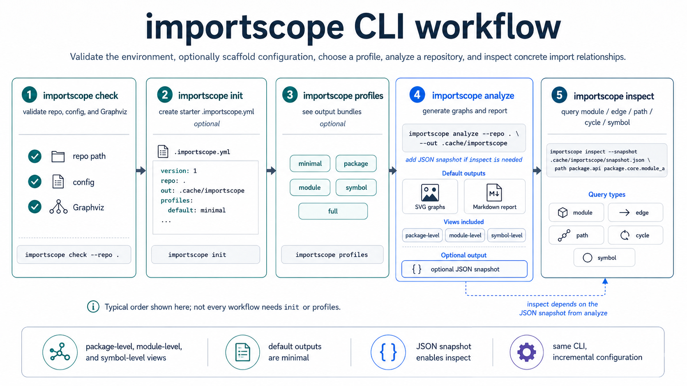

# 

`importscope` is organized around six top-level commands:

1. [`check`](./cli/check.md) to validate the setup
2. [`init`](./cli/init.md) to create or inspect config file
3. [`config`](./cli/config.md) to edit common config fields without hand-editing YAML
4. [`profiles`](./cli/profiles.md) to inspect available output bundles
5. [`analyze`](./cli/analyze.md) to generate graphs and other artifacts
6. [`inspect`](./cli/inspect.md) to query specific results (e.g. a problematic import edge)

## Default Workflow

If you are standing in the target repo root, the shortest useful workflow is:

```bash
importscope check
importscope init
importscope config exclude add 'tests/**'
importscope analyze
importscope inspect path mypackage.api mypackage.core --highlight
```

Those commands rely on the built-in defaults:

- repo: current directory
- config: auto-discovered `.importscope.yml` when present
- analyze output: `.cache/importscope`
- inspect snapshot: `.cache/importscope/analysis_snapshot.json`

Only add flags when you need to override that default flow.

## Related pages

- [Quickstart](./quickstart.md)
- [Configuration](./configuration.md)
- [Examples](./learn/guides/index.md)
