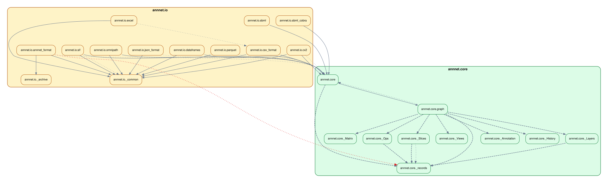
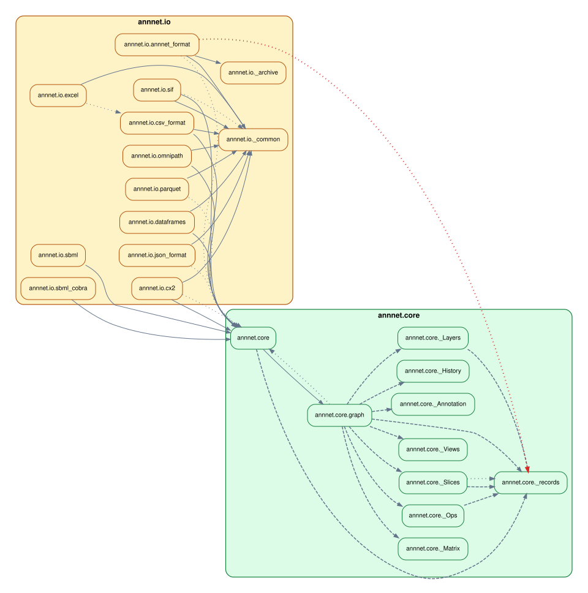

# Configuration

`importscope` can run with no config, but most useful repo analyses end up
using an `.importscope.yml`.

The important change is that you no longer need to start by hand-editing YAML.
The normal workflow is:

```bash
importscope init
importscope config ...
importscope analyze
```

Manual YAML is still useful for advanced cases, but it should be the escape
hatch, not the first step.

## Start small

Create a compact starter config:

```bash
importscope init
```

If you want to inspect it before writing:

```bash
importscope init --stdout
```

Typical output after `init`:

```yaml
tool:
  default_profile: overview
discovery:
  exclude:
    - .venv/**
    - venv/**
    - .tox/**
    - build/**
    - dist/**
    - .git/**
policy:
  enabled: false
```

That is intentionally small:

- one default profile
- a few standard excludes
- policy mode off
- no hand-authored colors or display groups

## Edit the config with commands

For common changes, use `importscope config` instead of editing YAML directly.

Examples:

```bash
importscope config package set mypackage
importscope config exclude add 'docs/**' 'tests/**'
importscope config include add 'mypackage/**'
importscope config policy enable
importscope config module-group-depth set 3
importscope config forbid add mypackage.domain mypackage.persistence
importscope config allowed-private add mypackage._
importscope config show
```

The matching remove and unset operations are available too:

```bash
importscope config package unset
importscope config exclude remove 'tests/**'
importscope config include remove 'mypackage/**'
importscope config policy disable
importscope config module-group-depth unset
importscope config forbid remove mypackage.domain mypackage.persistence
importscope config allowed-private remove mypackage._
```

If you want to see the merged config with built-in defaults:

```bash
importscope config show --effective
```

## Demo repo example

On the demo repo from the quickstart, these commands produce the checked-in
config used in the docs:

```bash
importscope init
importscope config package set demo_shop
importscope config exclude add 'docs/**' 'tests/**'
importscope config policy enable
importscope config module-group-depth set 3
importscope config forbid add demo_shop.domain demo_shop.persistence
importscope config forbid add demo_shop.api demo_shop.persistence._
importscope config forbid add demo_shop.services demo_shop.persistence._
```

That yields:

```yaml
tool:
  default_profile: overview
discovery:
  exclude:
    - .venv/**
    - venv/**
    - .tox/**
    - build/**
    - dist/**
    - .git/**
    - docs/**
    - tests/**
policy:
  enabled: true
  module_group_depth: 3
  forbidden_imports:
    - source_prefixes:
        - demo_shop.domain
      target_prefixes:
        - demo_shop.persistence
    - source_prefixes:
        - demo_shop.api
      target_prefixes:
        - demo_shop.persistence._
    - source_prefixes:
        - demo_shop.services
      target_prefixes:
        - demo_shop.persistence._
package: demo_shop
```

## What stays automatic

You do not need to assign colors up front.

If `policy.display_groups` is absent, `importscope` derives display groups from
the discovered package structure and assigns colors automatically. That means
`init` can stay focused on the more important decisions:

- what package or slice to analyze
- what to exclude or include
- whether policy mode is on
- which import directions are forbidden

Only add custom `display_groups` when the auto-derived grouping is not the view
you want to present.

## What the main sections mean

### `package`

Restrict analysis to one package namespace.

Example:

```yaml
package: omnipath
```

Use this when the repo contains several packages, support scripts, or a `src/`
layout where you want one package-focused graph.

### `discovery.include` and `discovery.exclude`

Control which files are considered.

- `include` narrows scanning to a specific slice
- `exclude` removes noise from discovery

In practice:

- use `exclude` for most repos
- use `include` when the question is intentionally narrow

### `policy.enabled`

Turn policy classification on or off.

With policy off, graphs stay structural. With policy on, `importscope` can mark:

- forbidden imports
- private imports
- boundary/helper cleanup candidates

CLI flags still override the YAML for one run:

```bash
importscope analyze --policy
importscope analyze --no-policy
```

### `policy.module_group_depth`

Control how deep module-level clusters should split.

Examples:

- `2` groups `omnipath._core.base` under `omnipath._core`
- `3` groups `mypackage.adapters.sql.reader` under `mypackage.adapters.sql`

Use this when one module-level graph still has a box that is too large to read.

### `policy.forbidden_imports`

Declare architectural direction rules.

Example:

```yaml
forbidden_imports:
  - source_prefixes: ["mypackage.core"]
    target_prefixes: ["mypackage.api"]
```

That means modules under `mypackage.core` should not import modules under
`mypackage.api`.

### `policy.allowed_private_target_prefixes`

Allow private targets that are intentionally shared.

Example:

```yaml
allowed_private_target_prefixes:
  - mypackage._
```

Use this sparingly when leading-underscore modules are intentionally internal
but still part of the allowed architecture.

## When YAML is still the right tool

The command layer covers the common setup path, but manual YAML is still useful
for more advanced cases:

- custom `outputs.profiles`
- custom `outputs.tables`
- explicit `display_groups`
- explicit `policy_areas`
- `allowed_import_pairs`
- `boundary_helper_target_prefixes`
- `boundary_helper_symbols`

Those are still legitimate, but they should come after the first structural or
policy-aware run, not before it.

## Graph layout overrides

If one graph family is structurally correct but visually harder to read, add a
per-graph `layout` block under the profile graph spec.

Example:

```yaml
outputs:
  profiles:
    overview:
      graphs:
        - id: module-dependency
          stem: module_dependency_graph
          kind: module
          package_level: false
          labeled: false
          layout:
            direction: LR
            ranksep: 0.45
            nodesep: 0.25
            splines: false
```

Supported `direction` values are `TD`, `TB`, `BT`, `LR`, and `RL`.
`TD` is accepted for convenience and maps to Graphviz `rankdir="TB"` in DOT
output.

The same layout block is used for DOT and Mermaid output. Direction is the most
important setting, but `ranksep`, `nodesep`, `splines`, `ratio`, `pad`, and
`concentrate` can also be overridden when you need to tune a specific graph.

You can also remove a built-in default by setting it to `null`.

Example:

```yaml
outputs:
  profiles:
    overview:
      graphs:
        - id: module-dependency
          stem: module_dependency_graph
          kind: module
          package_level: false
          labeled: false
          layout:
            direction: LR
            ranksep: 1.8
            nodesep: 0.7
            pad: 0.6
            splines: spline
            ratio: null
```

This matters in practice because some Graphviz defaults are deliberately
compact. For example, `ratio: "compress"` can make a "wide" layout look too
similar to a tighter one by squeezing the final drawing back down. Setting
`ratio: null` lets Graphviz keep the larger spacing implied by the other layout
settings.

### Concrete comparison

On a real repository, direction changes usually matter more than spacing
changes. The example below uses a slice of `annnet` that keeps two level-1
branches, `annnet.core` and `annnet.io`, so the orientation change is easy to
see.

Baseline top-to-bottom profile graph spec:

```yaml
outputs:
  profiles:
    overview:
      graphs:
        - id: module-dependency
          stem: module_dependency_graph
          kind: module
          package_level: false
          labeled: false
          layout:
            direction: TB
```



Left-to-right profile graph spec:

```yaml
outputs:
  profiles:
    overview:
      graphs:
        - id: module-dependency
          stem: module_dependency_graph
          kind: module
          package_level: false
          labeled: false
          layout:
            direction: LR
            ranksep: 0.45
            nodesep: 0.25
            splines: false
```



If a "wide" profile still looks too similar to a tighter one, check whether a
default such as `ratio: "compress"` is still active. That setting can dominate
other spacing adjustments until you override it or unset it with `null`.

## Suggested workflow

1. Run one structural pass with no config.
2. Run `importscope init`.
3. Set `package` if inference did not pick the right scope.
4. Add a few `exclude` or `include` rules.
5. Enable policy only when you want findings, not just structure.
6. Add a small number of `forbid` rules for the import directions you actually care about.
7. Add custom groups or other advanced YAML only if the auto-derived view is not good enough.

Validate the result with:

```bash
importscope check
importscope config show --effective
```
