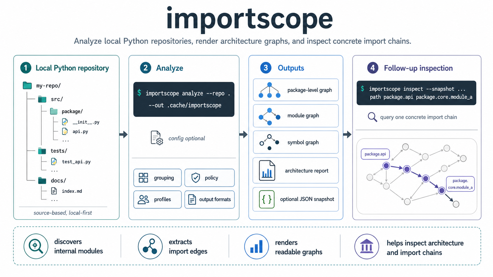
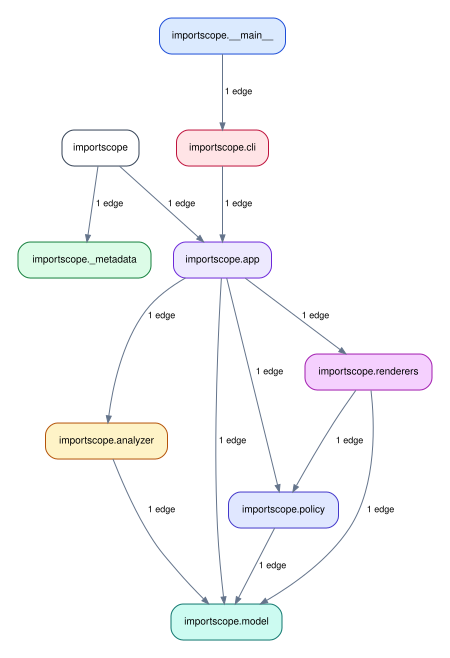

# 

`importscope` is a local-first CLI for understanding Python package structure
through imports. It is source-based, meaning that it does not execute the target
package and it does not build a runtime call graph.

It reads Python source files, discovers internal modules, extracts import
edges, and renders readable graphs and short reports.

## Typical use

`importscope` is useful when you want to:

- understand an unfamiliar Python codebase quickly
- inspect one concrete import chain
- review architectural boundaries inside a package
- surface private or forbidden imports
- generate visual artifacts before refactoring

## What you get

`importscope` can generate:

- package-level and module-level dependency graphs
- symbol import graphs
- optional CSV and JSON evidence files
- a Markdown architecture report

The default run stays minimal: SVG graphs plus the Markdown report. JSON, CSV,
and source graph files are opt-in.

### `importscope` on itself

The docs build also runs `importscope` on this repository itself, 
generating among others the following  package-level dependency graph:

## Default behavior

Without a config, `importscope` stays structural:

- it shows direct and lazy imports
- it groups modules into readable boxes
- it does not classify edges as forbidden or private

Policy mode is opt-in through a custom `.importscope.yml` configuration file.

On larger repos, the important decision is usually not "which command do I run?"
but "what slice of the repo do I want this run to explain?" The example guides
show a few coherent strategies:

- analyze one whole package when the package is already a useful architectural boundary
- focus on one subpackage inside a much larger repo
- exclude unrelated modules to isolate one cross-layer question
- add policy rules only after the structural view is readable

## Next steps

-   :material-download: __Installation__

    ---

    Set up `importscope` locally and verify the minimal environment before
    running the first analysis.

    [:octicons-arrow-right-24: Open installation](./installation.md)

-   :material-play-circle: __Quickstart__

    ---

    Walk through the demo repository end to end on a small package you can
    fully inspect.

    [:octicons-arrow-right-24: Open quickstart](./quickstart.md)

-   :material-source-branch: __Examples and guides__

    ---

    See how the same commands are scoped differently on larger repositories
    and more specific architectural questions.

    [:octicons-arrow-right-24: Open guides](./learn/guides/index.md)

-   :material-console: __CLI reference__

    ---

    Go straight to the command reference if you already know the workflow you
    want and need exact options.

    [:octicons-arrow-right-24: Open CLI docs](./cli.md)

