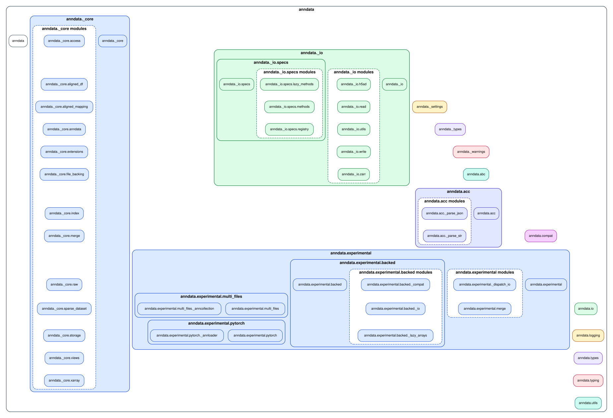
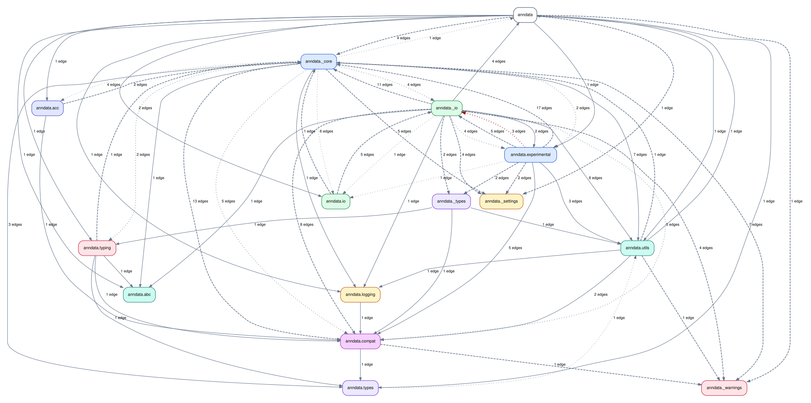

# Run `importscope` on `anndata`

Repo: [`scverse/anndata`](https://github.com/scverse/anndata)

This example is about package modularization and one cycle-relevant package
back-edge. The config used for the run is
[`anndata/.importscope.yml`](https://github.com/saezlab/importscope/tree/main/docs/examples/anndata/.importscope.yml).

Equivalent setup:

```bash
importscope init
importscope config package set anndata
importscope config exclude add 'docs/**' 'tests/**' 'benchmarks/**' 'ci/**' 'src/anndata/tests/**'
importscope config policy enable
importscope config module-group-depth set 3
importscope config forbid add anndata.experimental._dispatch_io anndata._io.specs
importscope config allowed-private add anndata._
```

Why this scope:

- `anndata` is already a meaningful package boundary, so a whole-package view is useful
- the goal is broad structure, not one tiny slice
- one policy rule is enough to highlight a specific architectural back-edge without turning the guide into a full policy audit

```bash
git clone https://github.com/scverse/anndata.git
cd anndata
importscope analyze \
  --config .importscope.yml \
  --graph module-layout \
  --graph package-dependency \
  --out .cache/importscope
```

What is being analyzed:

- `49` modules
- `278` internal import edges
- `1` cycle

What that config does:

- keeps the whole `anndata` package as the analysis boundary
- removes docs, tests, and other non-package noise
- turns policy mode on
- marks one explicit back-edge as forbidden

First, the module layout. This is the package modularization view:



Then the package split. This is a grouped dependency graph over the analyzed
`anndata` package. `_core` is the architectural center, `_io` and
`experimental` sit around it. In this graph:

- the dark-red package edge reflects forbidden imports between the grouped areas
- lighter policy-marked edges come from boundary-helper findings surfaced by policy mode

Because this is a grouped package-level graph, multiple module-level findings
can collapse into one package-level edge.


