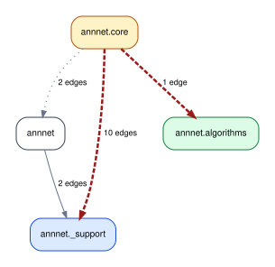

# Run `importscope` on `annnet`

Repo: [`saezlab/annnet`](https://github.com/saezlab/annnet)

This example is about a focused cross-layer view around `core`,
`algorithms`, and `_support`. The config used for the run is
[`annnet/.importscope.yml`](https://github.com/saezlab/importscope/tree/main/docs/examples/annnet/.importscope.yml).

Equivalent setup:

```bash
importscope init
importscope config package set annnet
importscope config exclude add 'docs/**' 'tests/**' 'benchmarks/**' 'notebooks/**' 'tools/**' 'annnet/adapters/**' 'annnet/io/**' 'annnet/utils/**'
importscope config policy enable
importscope config module-group-depth set 3
importscope config forbid add annnet.core.graph annnet._support.dataframe_backend
importscope config forbid add annnet.core.graph annnet.algorithms.traversal
importscope config allowed-private add annnet.core._ annnet._support
```

Why this scope:

- the guide is not trying to summarize the whole repository
- it intentionally excludes adapters, I/O, and utilities to isolate one cross-layer question
- this is the right pattern when a full-package graph would be technically correct but architecturally noisy

```bash
git clone https://github.com/saezlab/annnet.git
cd annnet
importscope analyze \
  --config .importscope.yml \
  --profile all \
  --graph package-dependency \
  --graph symbol-labeled-module-dependency \
  --out .cache/importscope \
  --format svg --format md --format json
```

What is being analyzed:

- `26` modules
- `40` internal import edges
- `0` cycles

That config narrows the analysis to the core/transversal slice:

- exclude adapters, I/O, and utilities
- keep policy mode enabled
- flag imports from `annnet.core.graph` into transversal support code

So the graph you see here is not the whole repo. It is a focused view where
imports from `annnet.core.graph` into the transversal layer are shown in red.



One concrete path inside the shown slice is:

```bash
importscope inspect \
  path annnet.core.graph annnet.algorithms.traversal
```

```json
{
  "mode": "path",
  "paths": [
    [
      "annnet.core.graph",
      "annnet.algorithms.traversal"
    ]
  ]
}
```

<small>For symbol-level detail in the focused slice, open
[the labeled module graph](../../assets/generated/annnet/module_dependency_with_symbols.svg).</small>
