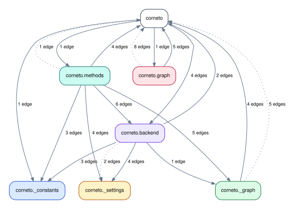
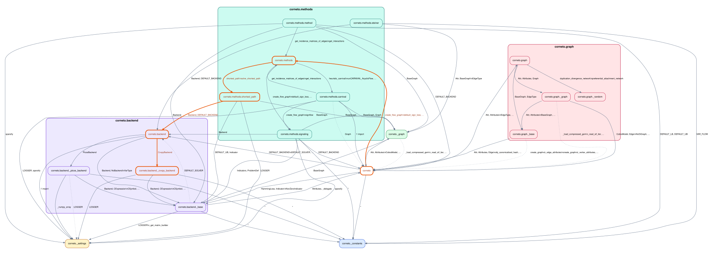
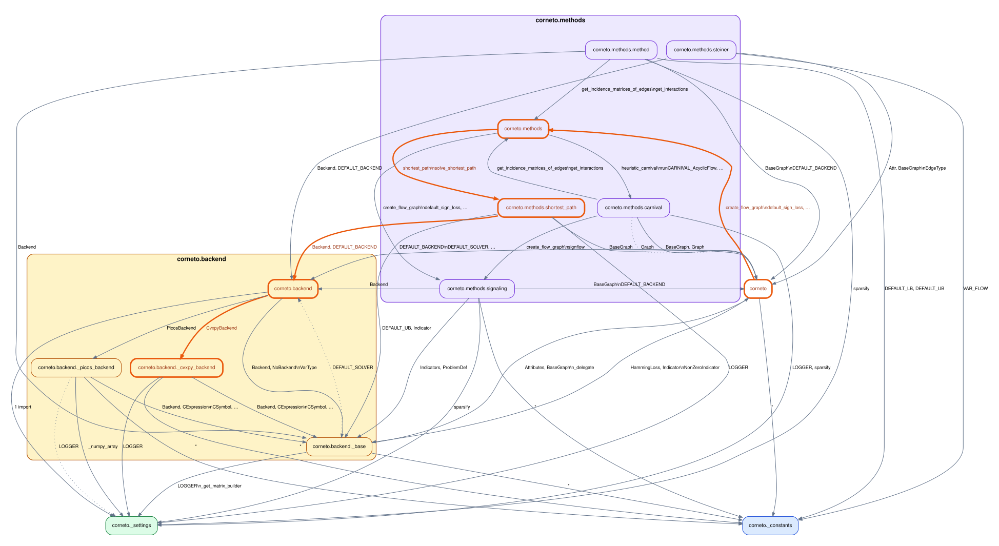

# Run `importscope` on `saezlab/corneto`

Repo: [`saezlab/corneto`](https://github.com/saezlab/corneto)

Config used for this guide:
[`docs/examples/corneto/.importscope.yml`](https://github.com/saezlab/importscope/tree/main/docs/examples/corneto/.importscope.yml)

Equivalent setup:

```bash
importscope init
importscope config package set corneto
importscope config include add 'corneto/__init__.py' 'corneto/_constants.py' 'corneto/_graph.py' 'corneto/_settings.py' 'corneto/backend/**' 'corneto/graph/**' 'corneto/methods/**'
importscope config exclude add 'docs/**' 'tests/**' 'scripts/**'
importscope config module-group-depth set 2
importscope config allowed-private add corneto._graph corneto._constants corneto._settings
```

This example is intentionally small. It does not try to explain the whole repo.
It answers one question only:

- how the public `corneto` package fans into graph code, methods, and backends

## Run

```bash
git clone https://github.com/saezlab/corneto.git
cd corneto
importscope analyze \
  --graph package-dependency \
  --graph symbol-labeled-module-dependency \
  --out .cache/importscope-corneto \
  --format svg --format md --format json
```

Current scope:

- `19` modules
- `84` internal import edges
- `1` strongly connected component

The config keeps only:

- `corneto`
- `corneto.graph` and `corneto._graph`
- `corneto.backend`
- `corneto.methods`
- small support files like `_constants` and `_settings`

## Start with the package graph



This is the useful first view. It is small enough to read and it shows the main
shape immediately:

- `corneto` is not just a thin facade
- it reaches directly into methods and backend code
- graph code sits in the middle of the slice

## One follow-up query

```bash
importscope inspect \
  path corneto corneto.backend._cvxpy_backend
```

```json
{
  "mode": "path",
  "paths": [
    [
      "corneto",
      "corneto.methods",
      "corneto.methods.shortest_path",
      "corneto.backend",
      "corneto.backend._cvxpy_backend"
    ]
  ]
}
```

If you want the path highlighted on the graph directly:

```bash
importscope inspect \
  path corneto corneto.backend._cvxpy_backend \
  --max-paths 5 \
  --path-index 4 \
  --highlight \
  --graph-format both
```

This selects the longer path:

```text
corneto
-> corneto.methods
-> corneto.methods.shortest_path
-> corneto.backend
-> corneto.backend._cvxpy_backend
```

Highlighted output:



## Tighten the scope

The selected path does not go through `corneto.graph` or `corneto._graph`, so
the extra `graph core` box is no longer useful for this question.

Use the narrower config:

- [`docs/examples/corneto/.importscope.no-graph.yml`](https://github.com/saezlab/importscope/tree/main/docs/examples/corneto/.importscope.no-graph.yml)

Equivalent setup for that narrower config:

```bash
importscope init
importscope config package set corneto
importscope config include add 'corneto/__init__.py' 'corneto/_constants.py' 'corneto/_settings.py' 'corneto/backend/**' 'corneto/methods/**'
importscope config exclude add 'docs/**' 'tests/**' 'scripts/**'
importscope config module-group-depth set 2
importscope config allowed-private add corneto._constants corneto._settings
```

Then rerun:

```bash
importscope analyze \
  --graph package-dependency \
  --graph symbol-labeled-module-dependency \
  --out .cache/importscope-corneto \
  --format svg --format md --format json

importscope inspect \
  path corneto corneto.backend._cvxpy_backend \
  --max-paths 5 \
  --path-index 4 \
  --highlight
```

Result with the `graph core` box removed:


