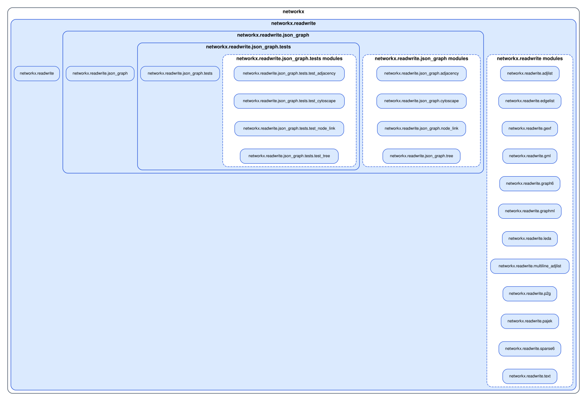

# Run `importscope` on `networkx`

Repo: [`networkx/networkx`](https://github.com/networkx/networkx)

This example is about taking one smaller package out of a very large repo. The
config used for the run is
[`networkx/.importscope.yml`](https://github.com/saezlab/importscope/tree/main/docs/examples/networkx/.importscope.yml).

Equivalent setup:

```bash
importscope init
importscope config package set networkx
importscope config exclude add 'doc/**' 'examples/**' 'benchmarks/**' 'tools/**' 'networkx/**/tests/**'
importscope config module-group-depth set 3
```

Why this scope:

- `networkx` is too large for a first whole-repo graph to be useful
- `networkx.readwrite` is a coherent subpackage with its own internal structure
- this is the right pattern when the repository is large but the architectural question is local to one namespace

```bash
git clone https://github.com/networkx/networkx.git
cd networkx
importscope analyze \
  --config .importscope.yml \
  --package networkx.readwrite \
  --profile all \
  --graph module-layout \
  --graph symbol-labeled-module-dependency \
  --out .cache/importscope/readwrite \
  --format svg --format md --format json \
  --exclude 'networkx/readwrite/tests/**'
```

What is being analyzed:

- only the `networkx.readwrite` package
- `23` modules
- `21` internal import edges
- `0` cycles

The config still excludes the wider repo noise, while `--package
networkx.readwrite` keeps the actual analysis question local to one
subpackage.

So the graph below is a smaller, higher-signal view centered on the
`readwrite` package rather than the whole `networkx` tree.



For denser detail, open
[the labeled module graph](../../assets/generated/networkx/module_dependency_with_symbols.svg).
