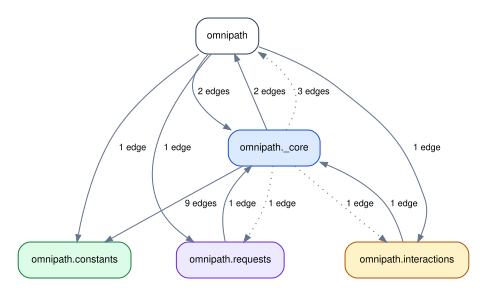
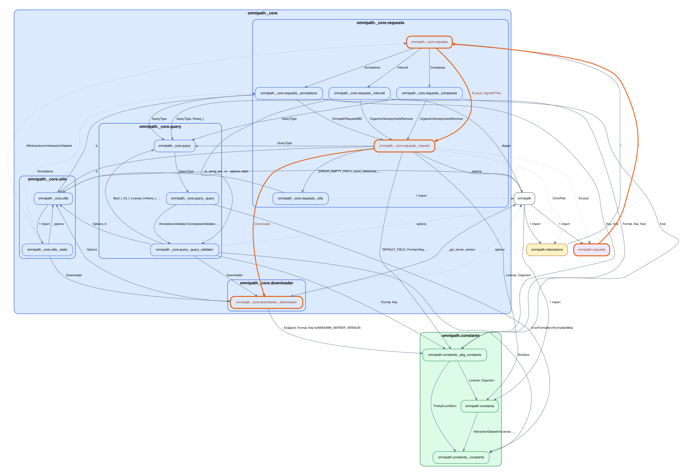

# Run `importscope` on `saezlab/omnipath`

Repo: [`saezlab/omnipath`](https://github.com/saezlab/omnipath)

Config used for this guide:
[`docs/examples/omnipath/.importscope.yml`](https://github.com/saezlab/importscope/tree/main/docs/examples/omnipath/.importscope.yml)

Equivalent setup:

```bash
importscope init
importscope config package set omnipath
importscope config include add 'omnipath/__init__.py' 'omnipath/requests.py' 'omnipath/interactions.py' 'omnipath/constants/**' 'omnipath/_core/downloader/**' 'omnipath/_core/requests/**' 'omnipath/_core/query/__init__.py' 'omnipath/_core/query/_query.py' 'omnipath/_core/query/_query_validator.py' 'omnipath/_core/utils/__init__.py' 'omnipath/_core/utils/_static.py'
importscope config exclude add 'docs/**' 'tests/**'
importscope config module-group-depth set 3
importscope config allowed-private add omnipath._core.downloader omnipath._core.query omnipath._core.requests omnipath._core.utils
```

This example is also intentionally small. It answers one question only:

- how `omnipath.requests` reaches the internal request engine and downloader

## Run

```bash
git clone https://github.com/saezlab/omnipath.git
cd omnipath
importscope analyze \
  --graph package-dependency \
  --graph symbol-labeled-module-dependency \
  --out .cache/importscope-omnipath \
  --format svg --format md --format json
```

Current scope:

- `19` modules
- `57` internal import edges
- `1` strongly connected component

The config keeps only:

- `omnipath`, `omnipath.requests`, and `omnipath.interactions`
- `_core.requests`
- `_core.query`
- `_core.downloader`
- a small amount of runtime helper code

## Start with the package graph



This is the graph to read first. It stays focused on one flow:

- public facade
- request engine
- query support
- downloader

The exact colors are auto-derived, but the useful architectural split is still
the same: public facade, request engine, query support, downloader, and a small
runtime helper area.

## One follow-up query

```bash
importscope inspect \
  path omnipath.requests omnipath._core.downloader._downloader
```

One current path is:

```json
{
  "mode": "path",
  "paths": [
    [
      "omnipath.requests",
      "omnipath._core.requests",
      "omnipath._core.requests._request",
      "omnipath._core.downloader._downloader"
    ]
  ]
}
```

If you want the path highlighted on the graph directly:

```bash
importscope inspect \
  path omnipath.requests omnipath._core.downloader._downloader \
  --highlight \
  --graph-format both
```

Highlighted output:


