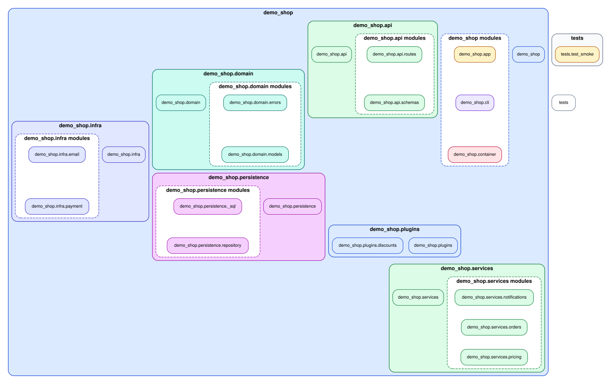
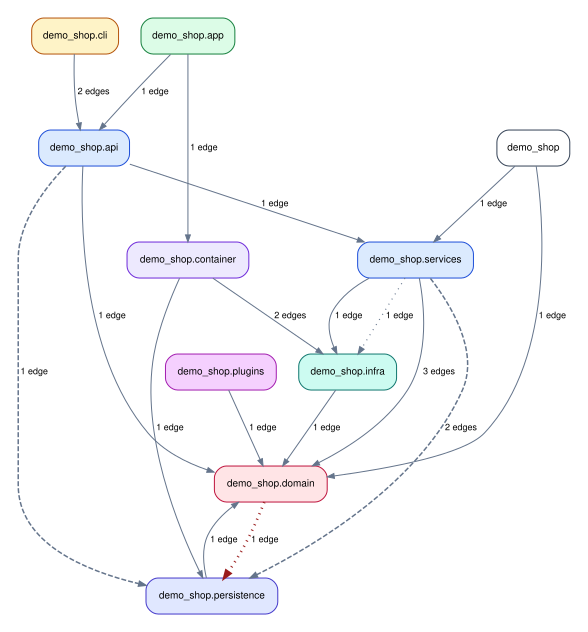

# Run `importscope` on a demo repo

This walkthrough uses a small sample repository under
[`docs/examples/demo-shop-repo/`](https://github.com/saezlab/importscope/tree/main/docs/examples/demo-shop-repo).
Treat the commands below as if you are standing in the root of that package repository.

This page is about learning the workflow, not about tuning the perfect config.
The idea is:

1. confirm discovery works
2. run one structural pass with no config
3. add a small config only when you want architecture-aware grouping and policy findings

That same sequence scales to real repositories, but on larger repos you usually
analyze only one package or one architectural slice at a time.

## What the repo looks like

The package is a small order-processing toy app with a few intentional import
smells:

- `demo_shop.api.routes` imports the private module `demo_shop.persistence._sql`
- `demo_shop.domain.models` contains a lazy import from persistence
- `demo_shop.services.notifications` contains a lazy import from infra

Key files:

```text
.
├── pyproject.toml
├── src/
│   └── demo_shop/
│       ├── __init__.py
│       ├── app.py
│       ├── cli.py
│       ├── container.py
│       ├── api/
│       │   ├── __init__.py
│       │   ├── routes.py
│       │   └── schemas.py
│       ├── domain/
│       │   ├── __init__.py
│       │   ├── errors.py
│       │   └── models.py
│       ├── infra/
│       │   ├── __init__.py
│       │   ├── email.py
│       │   └── payment.py
│       ├── persistence/
│       │   ├── __init__.py
│       │   ├── _sql.py
│       │   └── repository.py
│       ├── plugins/
│       │   ├── __init__.py
│       │   └── discounts.py
│       └── services/
│           ├── __init__.py
│           ├── notifications.py
│           ├── orders.py
│           └── pricing.py
└── tests/
    └── test_smoke.py
```

## 1. Check the repo

```bash
importscope check
```

Expected output:

```text
Profile: overview
Modules: 22
Edges: 37
No problems detected.
```

## 2. Start without a config

Before adding `.importscope.yml`, run one structural pass first.

```bash
importscope analyze \
  --graph module-layout \
  --out .cache/importscope
```

Expected output:

```text
Wrote outputs to: /path/to/demo-shop-repo/.cache/importscope
Modules parsed: 23
Internal import edges: 38
Cycles detected: 1
Policy findings: 0
```

This first pass is enough to start exploring the package layout:



The default `overview` profile can already emit a small structural bundle even
without a config:

```bash
importscope analyze --out .cache/importscope
```

Typical files:

- `module_layout_graph.svg`
- `group_dependency_graph.svg`
- `module_dependency_graph.svg`
- `architecture_report.md`

Without `.importscope.yml`, the run stays structural:

- no policy findings are reported
- the grouped graphs use the default package/other grouping
- discovery excludes from the repo-specific config are not applied yet

This is the right first move on an unfamiliar repo because it answers the basic
questions first:

- did `importscope` discover the package you expected?
- is the repo small enough for a whole-package view?
- do you already see suspicious edges or one oversized cluster that needs better grouping?

## 3. Create a starter config

Now generate a starter file:

```bash
importscope init --stdout
```

Expected output:

```yaml
tool:
  default_profile: overview
discovery:
  exclude:
    - .venv/**
    - venv/**
    - .tox/**
    - build/**
    - dist/**
    - .git/**
policy:
  enabled: false
```

That starter config is intentionally small. For this demo repo, the checked-in
config used below is generated by:

```bash
importscope init
importscope config package set demo_shop
importscope config exclude add 'docs/**' 'tests/**'
importscope config policy enable
importscope config module-group-depth set 3
importscope config forbid add demo_shop.domain demo_shop.persistence
importscope config forbid add demo_shop.api demo_shop.persistence._
importscope config forbid add demo_shop.services demo_shop.persistence._
```

Resulting config excerpt:

```yaml
tool:
  default_profile: overview
discovery:
  exclude:
    - .venv/**
    - venv/**
    - .tox/**
    - build/**
    - dist/**
    - .git/**
    - docs/**
    - tests/**
policy:
  enabled: true
  module_group_depth: 3
  forbidden_imports:
    - source_prefixes:
        - demo_shop.domain
      target_prefixes:
        - demo_shop.persistence
    - source_prefixes:
        - demo_shop.api
      target_prefixes:
        - demo_shop.persistence._
    - source_prefixes:
        - demo_shop.services
      target_prefixes:
        - demo_shop.persistence._
package: demo_shop
```

This config does three useful things:

- narrows discovery so the counts match the intended package slice
- keeps grouping and colors automatic
- enables a small set of policy rules so findings become reviewable

## 4. Inspect profiles after adding config

`profiles` lists the output bundles available for the current repo and config.
In this demo repo, adding `.importscope.yml` does not rename or add profiles,
because the config mainly defines grouping and policy rules, not custom profile
definitions.

```bash
importscope profiles
```

Expected output:

```text
all: All graph families and reports.
overview: Repo overview with grouped dependency graphs and summary report.
policy: Policy-focused violation and helper cleanup outputs.
symbols: Comprehensive symbol import graph plus summary.
```

If you define your own `outputs.profiles` in `.importscope.yml`, this command
will reflect them.

## 5. Run the configured analysis

With the repo config in place, you can ask for richer outputs:

```bash
importscope analyze \
  --config .importscope.yml \
  --profile all \
  --graph package-dependency \
  --graph symbol-labeled-module-dependency \
  --graph symbol-import \
  --policy \
  --out .cache/importscope/full \
  --format svg --format md --format json
```

Expected output:

```text
Wrote outputs to: /path/to/demo-shop-repo/.cache/importscope/full
Modules parsed: 22
Internal import edges: 37
Cycles detected: 1
Policy findings: 2
```

Generated files:

- `module_layout_graph.svg`
- `group_dependency_graph.svg`
- `module_dependency_with_symbols.svg`
- `symbol_import_graph.svg`
- `architecture_report.md`
- `analysis_snapshot.json`

Compared with the no-config run, this configured run gives you:

- policy-aware edge classification on top of the structural graphs
- auto-derived grouping and coloring for the package layout
- the repo-specific discovery excludes, so the counts drop from `23/38` to `22/37`
- symbol-labeled module edges
- the comprehensive symbol import graph
- a JSON snapshot for `inspect`

This is the full learning loop on the sample repo:

1. no-config run for discovery and rough structure
2. config-backed run for architectural interpretation
3. `inspect` on the saved snapshot when you want one concrete path or edge

If you want the path rendered back onto a graph instead of only as JSON:

```bash
importscope inspect \
  path demo_shop demo_shop.persistence._sql \
  --highlight \
  --graph-format both
```

That writes a highlighted module path graph alongside the normal outputs.

## How this maps to real repos

Use the same workflow, but change the scope:

- small package repo: analyze the whole package first, as done here
- larger multi-package repo: pass `--package` to isolate one package
- noisy repo with one specific question: keep the package, then exclude unrelated directories in config
- dense repo with too many internals in one box: keep the same scope, then refine `module_group_depth`

The [real-repo examples](./learn/guides/index.md) show each of those patterns on
different repositories.

## 6. Inspect the outputs

Architecture report excerpt:

```md
# Import graph report

- Modules parsed: `22`
- Internal import edges: `37`
- Lazy local edges: `2`
- Strongly connected components >1: `1`
- Private import edges: `3`
- Cross-area private import edges: `0`
- Boundary/helper cleanup candidate edges: `1`

## Findings summary

- `boundary_helper`: `1`
- `forbidden_import`: `1`
```

Package-level dependency graph:



Module dependency graph with symbols:

- [Open the module dependency graph with symbols](assets/generated/demo-shop/module_dependency_with_symbols.svg)

Comprehensive symbol import graph:

- [Open the comprehensive symbol import graph](assets/generated/demo-shop/symbol_import_graph.svg)

## 7. Inspect one concrete trace

Inspect one path:

```bash
importscope inspect \
  --snapshot .cache/importscope/full/analysis_snapshot.json \
  path demo_shop.api.routes demo_shop.infra.email
```

Expected output:

```json
{
  "mode": "path",
  "paths": [
    [
      "demo_shop.api.routes",
      "demo_shop.services.orders",
      "demo_shop.services.notifications",
      "demo_shop.infra.email"
    ]
  ]
}
```

Inspect the private import edge:

```bash
importscope inspect \
  --snapshot .cache/importscope/full/analysis_snapshot.json \
  edge demo_shop.api.routes demo_shop.persistence._sql
```

Expected output:

```json
{
  "matches": [
    {
      "imported": ["quote_identifier"],
      "lazy_kind": "eager",
      "line": 10,
      "source": "demo_shop.api.routes",
      "target": "demo_shop.persistence._sql"
    }
  ],
  "mode": "edge"
}
```
